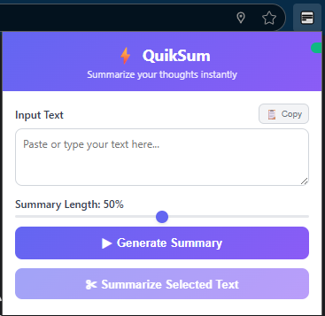
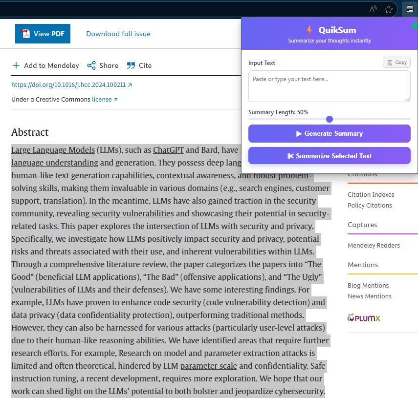

# QuikSum

QuikSum is a browser extension designed to quickly and accurately summarize raw text selections. Ideal for researchers, students, or anyone looking to save time by reading condensed versions of lengthy documents.

## ✨ Features

- **Quick Summarization of Text Selections**: Instantly summarize any text you highlight.
- **Customizable Summary Length**: Choose the level of detail you want for your summaries.
- **User-Friendly Interface**: Simple, clean design for easy access and operation.

## 🖼️ Extension Preview

*The main QuikSum popup interface.*

*Summarizing selected text from a webpage.*

## 🚀 Installation

1. Clone or download this repository.
2. Open your browser and navigate to the Extensions page:
   - **Chrome**: `chrome://extensions`
   - **Firefox**: `about:addons`
3. Enable Developer Mode (in Chrome).
4. Select **Load Unpacked** (in Chrome) or **Load Temporary Add-on** (in Firefox).
5. Choose the folder containing the extension files to install QuikSum.

## 🧠 Usage

### Summarize Selected Text

- Highlight any text on a webpage.
- Right-click and select **"Summarize with QuikSum"** from the context menu.
- A popup will display the summarized version.

## ⚙️ Technical Details

This extension leverages NLP techniques for extracting key sentences and condensing large chunks of text while retaining essential information.

**Tech stack includes:**

- JavaScript (main extension logic)
- Chrome Extension API (for file handling and user interactions)
- Python (optional backend for advanced NLP models)

## 📄 License

This project is licensed under the MIT License.
